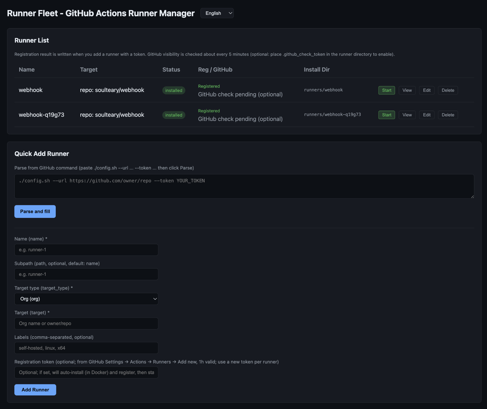

# Runner Fleet - GitHub Actions Runner Manager

**文档 (Docs):** [中文](docs/zh/) · [Français](docs/fr/) · [Deutsch](docs/de/) · [한국어](docs/ko/) · [日本語](docs/ja/)


HTTP management UI built with Golang Echo to view and manage multiple self-hosted GitHub Actions Runners on one machine. YAML-based config, no database required.

**Linux only** (`linux/amd64`, `linux/arm64`): runner liveness is read from `/proc`. The UI is translated into six languages, but server-side messages and logs are currently Chinese only — see the [User Guide](docs/guide.md#1-deployment-docker).



## Highlights

- **Zero database**: YAML-only config, no external deps; the config *is* your backup and is easy to version.
- **Web one-stop**: add, register, start/stop, edit and inspect runners in the UI — no SSH, no hand-run `config.sh`. Paste GitHub's `./config.sh --url … --token …` and the form fills itself; name and directory conflicts surface while you type, with a suggested name.
- **Container-first**: Docker / docker-compose out of the box; DinD and host-socket for in-job Docker; optional **container mode** (one runner per container) with the Manager owning lifecycle and status.
- **Config drift is repaired, not just reported**: image, network, mount directory, in-job Docker backend and the agent token are all fixed at `docker create` time, so editing the config never reached an existing container. The Manager compares each container against the current config — a **stopped** runner is rebuilt on its next start, a **running** one is flagged with the exact difference and rebuilt when you say so.
- **Hosted-CLI baseline + custom images**: stock images align the CLI layer with GitHub-hosted `ubuntu-24.04`; extend with Android / Node and friends via [`examples/runner-images/`](examples/runner-images/) and per-runner `container_image`.
- **Self-heals, and says why when it can't**: registered-but-stopped runners start ~15s after boot and are re-checked every 5 minutes; in container mode a failed probe returns a structured diagnosis — error type, a check command and a fix command — instead of a bare "unknown".
- **Observable**: `/ready` and Prometheus `/metrics` for the deployment, the registration result per runner, and an optional PAT that keeps the UI in sync with what GitHub actually lists.

## Quick start

```bash
mkdir -p config runners && cp config.yaml.example config/config.yaml
# Edit config/config.yaml: set runners.base_path to /app/runners
sudo chown -R 1001:1001 config runners

docker network create runner-net 2>/dev/null || true
docker compose up -d
```

Open http://localhost:8080. The default image tag is the stable release (e.g. v1.7.1). For more options (docker run, DinD, container mode, using `main` or other tags) see the [User Guide](docs/guide.md). Probes, Prometheus metrics and logging: [Operations](docs/guide.md#5-operations) — `GET /health` (liveness), `GET /ready` (readiness), `GET /metrics`, `GET /version`.

Two copy-and-go deployments live in [`examples/deploy/`](examples/deploy/): `standalone/` (single container, runner processes inside the Manager — `docker run` or Compose) and `fleet/` (one container per runner, image and toolchain caches shared, build caches isolated).

## Documentation

- **[User Guide](docs/guide.md)** — deployment, configuration, adding runners, operations, security & troubleshooting
- **[Deployment examples](examples/deploy/)** (中文) — single-container and multi-container setups, which caches are shared and which isolated, deployment pitfalls
- **[Development & Build](docs/development.md)** — Go build, local debug, HTTP API, Makefile
- **[Changelog](CHANGELOG.md)** — release history and upgrade notes

## Other

CI / images / releases: [.github/workflows](.github/workflows).

MIT License — see [LICENSE](LICENSE).
