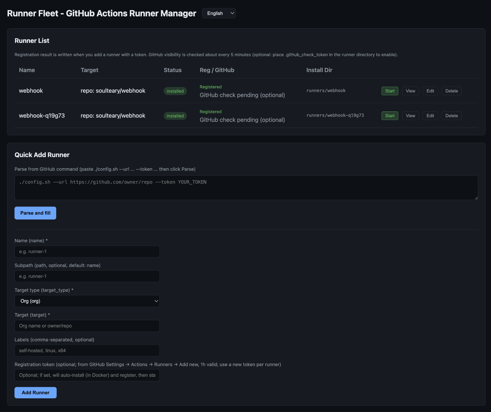

# Dokumentation

**文档 / Docs:** [EN](../) · [中文](../zh/) · [Français](../fr/) · Deutsch · [한국어](../ko/) · [日本語](../ja/)

- **[Benutzerhandbuch](guide.md)** — Bereitstellung, Konfiguration, Runner hinzufügen, Sicherheit und Fehlerbehebung
- **[Entwicklung & Build](development.md)** — Build, API, Makefile

[← Zurück zur Projektstartseite](../../README.md)
