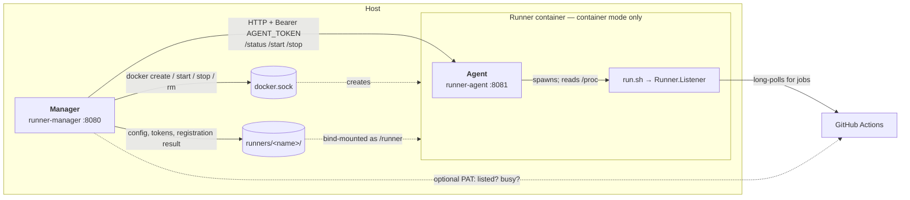

# Développement et build

**文档 / Docs:** [EN](../development.md) · [中文](../zh/development.md) · Français · [Deutsch](../de/development.md) · [한국어](../ko/development.md) · [日本語](../ja/development.md)


En production, utilisez le déploiement conteneur ; voir [Guide d'utilisation](guide.md). Ce document est pour les contributeurs : build et débogage locaux.

## Prérequis

- Go 1.27 (en cohérence avec [go.mod](../../go.mod)).

## Architecture

Trois processus. Ce qui compte, c'est de savoir lequel possède quoi.



Les étiquettes du diagramme restent en anglais dans toutes les traductions : ce sont des noms de
processus, des chemins et des endpoints, et traduire un identifiant le rend plus difficile à
grep sans le rendre plus lisible.

**Le Manager orchestre ; il n'héberge pas les runners.** En mode conteneur, chaque runner est son
propre conteneur, créé par le Manager via la socket Docker de l'hôte — d'où le fait que le Manager
ait besoin de cette socket et ne doive pas être pointé vers DinD. En mode par défaut il n'y a ni
Agent ni conteneur runner : les processus runner tournent dans le conteneur du Manager lui-même,
qui lit `/proc` directement. Dans les deux modes, celui qui détient le PID 1 arrête les runners
avant de se terminer : sur SIGTERM l'Agent arrête son runner et l'attend, et en mode par défaut le
Manager fait de même pour les runners de son propre conteneur. Devant les deux se tient `tini`, qui
récupère ce qu'un job laisse orphelin.

**L'état traverse une frontière de processus, donc il passe par HTTP.** Le Manager et un conteneur
runner sont dans des namespaces PID différents : le Manager ne voit pas les processus du runner, il
interroge l'Agent, qui lit son propre `/proc`. Cet appel porte un jeton bearer propre à chaque
runner, car n'importe quel conteneur du même réseau Docker peut atteindre `/start` et `/stop` de
l'Agent. Quand l'appel échoue, la réponse est `unknown`, jamais `installed` : « enregistré mais pas
en cours, donc démarrons-le » ne doit pas se déclencher sur un runner que le Manager n'a pas pu
joindre. Voir [Comment l'état d'exécution est déterminé](#comment-létat-dexécution-est-déterminé).

**Neuf choses sont figées au moment du `docker create`** et ne changent plus ensuite : nom du
conteneur, image, réseau, répertoire monté, backend Docker pour les jobs, hôte DinD, GID docker,
jeton d'Agent et les limites de ressources. `docker start` ne fait que relancer ce qui était déjà
construit, donc modifier la configuration seule n'atteint jamais un conteneur existant. C'est toute
la raison d'être de la détection de dérive : le Manager compare les paramètres de création réels de
chaque conteneur à la configuration courante, reconstruit un conteneur **arrêté** à son prochain
démarrage, et se contente de signaler un conteneur **en cours** plutôt que d'interrompre un job.
L'image est comparée par ID autant que par référence, donc reconstruire le même tag compte aussi.

## Build

```bash
# Construire le binaire runner-manager
go build -o runner-manager ./cmd/runner-manager

# Avec version (pour /version et débogage)
go build -ldflags "-X main.Version=1.9.0" -o runner-manager ./cmd/runner-manager

# Construire uniquement le Runner Agent (mode conteneur)
go build -o runner-agent ./cmd/runner-agent

# Ou Make : make build / make build-agent / make build-all
```

Les templates sont intégrés dans le binaire Manager (`cmd/runner-manager/templates/`) ; binaire unique, pas besoin de fournir `templates/`.

## Exécution et débogage locaux

```bash
mkdir -p config && cp config.yaml.example config/config.yaml
go run ./cmd/runner-manager
# Ou make run (build puis exécution) ; config personnalisée : ./runner-manager -config /path/to/config.yaml
```

Écoute sur `:8080`, http://localhost:8080. Basic Auth pour le débogage : `BASIC_AUTH_PASSWORD=secret go run ./cmd/runner-manager` ; voir [Guide – Sécurité](guide.md#4-sécurité-et-validation).

## Options CLI

- `-config <path>` : Chemin du fichier de configuration.
- `-version` : Affiche la version et quitte (injection à la build avec `-ldflags "-X main.Version=..."`).

## API HTTP

Avec Basic Auth, toutes les requêtes sauf `/health` et `/ready` doivent inclure `Authorization: Basic <base64(user:password)>` dans l'en-tête.

| Chemin | Méthode | Description |
|--------|---------|-------------|
| `/health` | GET | Liveness. Retourne `{"status":"ok","service":"runner-fleet"}` ; toujours 200 tant que le processus tourne, sans vérification de dépendance ; toujours sans authentification. |
| `/ready` | GET | Readiness. Même forme de corps ; 503 si la configuration ne peut être chargée ou si le répertoire de base des runners est absent ou non inscriptible. Pour la `readinessProbe` K8s ; également sans authentification, et n'indique jamais quelle vérification a échoué. |
| `/version` | GET | Retourne `{"version":"..."}`. |
| `/metrics` | GET | Métriques Prometheus (nombre de requêtes et latence). Le label `path` utilise le modèle de route Echo (`/api/runners/:name`), pas l'URL de la requête. **Authentification requise** si Basic Auth est activé — configurez `basic_auth` dans le job de scrape. |
| `/api/runners` | GET | Liste des runners. En mode conteneur, en cas d'échec de sonde retourne `status=unknown` avec `probe` structuré (`error/type/suggestion/check_command/fix_command`). |
| `/api/runners/:name` | GET | Détails d'un runner. Même `probe` en cas d'échec de sonde en mode conteneur. |
| `/api/runners/:name/start` | POST | Démarrer le runner. En cas d'échec de sonde tente quand même le démarrage, retourne `probe` structuré dans la réponse. |
| `/api/runners/:name/stop` | POST | Arrêter le runner. En cas d'échec de sonde tente quand même l'arrêt, retourne `probe` structuré dans la réponse. |
| `/api/runners` | POST | Ajoute un runner (installation et enregistrement optionnels). En cas de conflit de nom, renvoie **409** avec `conflicts` et `suggested_name` au lieu de renommer silencieusement ; envoyez `auto_rename: true` pour l'ancien comportement. |
| `/api/runners/:name` | DELETE | Supprime un runner : l'arrête, le désenregistre de GitHub lorsqu'un PAT est disponible, supprime son répertoire d'installation, le retire de la configuration. La réponse porte `github_deregistered` et un `message` qui indique ce qui s'est passé côté GitHub. |
| `/api/runners/:name/recreate` | POST | Supprime et recrée le conteneur du runner avec la configuration actuelle (mode conteneur uniquement). Interrompt un job en cours ; un conteneur arrêté est de toute façon recréé automatiquement au démarrage si ses paramètres de création ont divergé. |
| `/api/runner-precheck` | GET | Pré-vérification d'un nom avant l'ajout : `?name=&path=`. Renvoie `available`, un `suggested_name` et les `conflicts` détectés (`name_taken`, `container_name`, `install_dir`, `dir_registered`, `dir_adopt`, `dir_exists`, `container_exists`), chacun avec `level` (`error`/`warn`), `message`, `detail` et un `fix_command` optionnel. En lecture seule ; l'interface l'appelle pendant la saisie. |
| `/api/runner-rows` | GET | Rend uniquement le `<tbody>` de la liste, à partir du même fragment de template que le premier rendu. L'interface l'interroge pour rafraîchir la liste sur place. |
| `/static/*` | GET, HEAD | Feuille de style et script embarqués (`//go:embed`). Les URL portent une empreinte de contenu (`?v=<hash>`) : les requêtes avec empreinte sont mises en cache longtemps, les autres revalident. `HEAD` est enregistré avec `GET` pour qu'une sonde ou un proxy ne reçoive pas un 405. |

### Requêtes intersites (CSRF)

Les endpoints d'écriture (`POST`, `PUT`, `DELETE`) rejettent les requêtes que le navigateur
signale comme intersites. Sans cela, une page servie par n'importe quelle autre origine pouvait
soumettre un formulaire vers `POST /api/runners` : il s'agit d'une « requête simple » au sens
CORS, donc envoyée sans préflight, et le navigateur y joint les identifiants Basic Auth qu'il a
mis en cache pour cette origine. Ouvrir une page malveillante suffisait donc à ajouter ou
arrêter un runner. `PUT` et `DELETE` déclenchent toujours un préflight : ce n'était pas la
partie exposée. C'était `POST`, et `/api/runners/:name/{start,stop,recreate}` sont tous en POST.

Le contrôle lit d'abord `Sec-Fetch-Site` : le navigateur le calcule localement, un reverse
proxy qui réécrit `Host` ne peut donc pas le casser (Chrome 76+, Firefox 90+, Safari 16.4+).
Seul `same-origin` passe ; `same-site` non, car un sous-domaine ou un autre port est une autre
origine et il s'agit ici d'une interface d'administration. Les navigateurs trop anciens pour
l'envoyer retombent sur la comparaison entre `Origin` et le `Host` de la requête — tous les
navigateurs actuels envoient `Origin` sur un POST intersite.

Une requête sans **aucun** de ces deux en-têtes ne vient pas d'un navigateur (curl, scripts de
CI). Elle ne détient ni cookie ni Basic Auth en cache, elle ne peut donc pas constituer une
attaque CSRF, et elle passe — l'API reste scriptable, et aucun jeton ni en-tête supplémentaire
n'est requis nulle part.

Deux conséquences :

- **Les corps de requête sont exclusivement en JSON.** `AddRunnerRequest` et
  `UpdateRunnerRequest` ne portent aucun tag `form` : une requête encodée en formulaire se lie
  donc à une structure vide et échoue à la validation, même si elle franchissait le middleware.
  L'interface web poste déjà du JSON — son usage de `FormData` sert uniquement à lire les
  champs de l'élément de formulaire.
- **`TRUSTED_ORIGINS` est la porte de sortie.** Si un reverse proxy réécrit `Host` au point que
  vos propres requêtes sont refusées, listez-y les origines telles que le navigateur les voit,
  séparées par des virgules (`https://ci.example.com`). Elles sont autorisées quoi que dise
  `Sec-Fetch-Site` : n'y mettez que des origines que vous maîtrisez.

### Changement incompatible (note de mise à jour)

Les anciens champs plats `probe_*` sont supprimés ; utilisez l'objet `probe` : `probe.error`, `probe.type`, `probe.suggestion`, `probe.check_command`, `probe.fix_command`. Valeurs de `probe.type` : `docker-access`, `agent-http`, `agent-connect`, `unknown`. L'interface peut toujours « Start/Stop » pour l’auto-réparation quand `status=unknown`.

Exemple (échec de sonde) :

```json
{
  "name": "runner-a",
  "status": "unknown",
  "probe": {
    "error": "agent returned 502: bad gateway",
    "type": "agent-http",
    "suggestion": "Check runner container logs and Agent + /runner process state",
    "check_command": "docker ps -a | rg \"github-runner-\" && docker logs --tail=200 <runner_container_name>",
    "fix_command": "docker restart <runner_container_name>"
  }
}
```

### Comment l'état d'exécution est déterminé

`internal/runnerproc` répond à « le processus de ce runner est-il vivant ? » en parcourant
`/proc` à la recherche d'un processus dont l'argv revendique ce répertoire d'installation —
`<dir>/bin/Runner.Listener`, ou un shell exécutant `<dir>/run.sh` ou `<dir>/run-helper.sh`.

Il ne lit délibérément **pas** de fichier pid, parce qu'actions/runner n'en écrit aucun. Ni
`run.sh`, ni `run-helper.sh.template`, ni `runsvc.sh` n'écrivent de pid où que ce soit ; le pid
ne vit que dans une variable de shell. Le fichier `.path` d'un répertoire d'installation
contient une chaîne PATH, pas un pid (`runsvc.sh` fait lui-même `export PATH=$(cat .path)`).
Lire l'un ou l'autre de ces noms échouait donc systématiquement, ce qui faisait rapporter
« enregistré mais non démarré » à chaque runner, indéfiniment.

Le shell superviseur compte comme en cours d'exécution même quand `Runner.Listener` a
momentanément disparu : `run-helper.sh` dort 5 secondes sur un code de sortie 2, puis `run.sh`
relance le listener. Un test portant uniquement sur le listener déclarerait donc le runner mort
à chaque redémarrage.

Deux conséquences pour les appelants :

- `runner.List` est une vue au niveau du disque. En mode conteneur, son `Running` vaut toujours
  false — le Manager et les runners sont dans des espaces de noms PID différents. Utilisez
  `runner.ListWithLiveStatus`, qui interroge l'Agent de chaque conteneur, dès que la réponse
  déclenche une action. Elle transforme un échec de sonde en `status=unknown` plutôt qu'en
  `installed`, de sorte que « enregistré mais pas démarré, donc on le démarre » ne peut pas se
  déclencher sur un runner qu'elle n'a pas pu joindre.
- La détection nécessite `/proc` : elle est donc réservée à Linux ; ailleurs, elle rapporte
  « non démarré ».

### Permissions du répertoire d'un runner

Le répertoire d'installation d'un runner est créé en 0700. `config.sh` y écrit
`.credentials_rsaparams` — la clé privée RSA avec laquelle le runner s'authentifie auprès de
GitHub — et actions/runner ne pose aucune permission Unix dessus (`ConfigurationStore` ne pose
que l'attribut Hidden de Windows, le fichier suit donc l'umask, en général 0644). Le mode du
répertoire est par conséquent la seule chose qui sépare cette clé des autres utilisateurs
locaux de la machine.

`MkdirAll` ne touche pas au mode d'un répertoire existant : ceux créés par les versions
antérieures restent en 0755. `Preflight` les signale, avec un `chmod 700` prêt à exécuter,
plutôt que de les modifier lui-même : resserrer un répertoire alors que le Manager et le
conteneur tournent sous des UID différents casserait un déploiement qui fonctionne, et cette
décision revient à une personne.

`base_path` lui-même reste traversable — il ne contient aucun identifiant, et c'est le point de
montage hôte en mode conteneur.

Cela ne change pas ce qu'un job peut atteindre. Avec `job_docker_backend: host-socket`, un job
peut monter n'importe quel chemin de l'hôte, ce dont la documentation de déploiement avertit
déjà ; le mode protège des autres utilisateurs locaux, pas de cela.

### Suppression d'un runner et GitHub

`DELETE /api/runners/:name` retire un runner de cet outil **et** de GitHub. Le côté GitHub exige
un identifiant, et le seul dont cet outil dispose jamais est le PAT facultatif propre à chaque
runner, dans `config/tokens/<nom du runner>` — le même fichier que celui utilisé
par la vérification de visibilité. Le désenregistrement s'exécute donc toujours *avant* la suppression
du répertoire d'installation : un PAT qu'une version antérieure y a laissé en est extrait au passage ;
ignorer cet ordre revient à perdre silencieusement la possibilité de le faire.

Sans PAT, le runner ne peut pas être désenregistré : GitHub veut un PAT ou un removal token
frais, et `config.sh remove` veut ce dernier. La réponse le dit alors explicitement et indique
où le supprimer à la main. Mieux vaut le dire que l'avaler — un runner laissé derrière fait
échouer le prochain `config.sh --name <même nom>` sur `A runner exists with the same name`.

`registered_on_github` est un booléen **nullable** : `true` / `false` sont des réponses, `null`
signifie qu'aucune réponse n'a été obtenue, et `github_check_error` en porte la raison. Les
templates ne doivent pas le tester avec `{{if .RegisteredOnGitHub}}` — `html/template` juge un
pointeur à sa seule nullité, un pointeur vers `false` est donc vrai. Utilisez les helpers
`GitHubYes` / `GitHubNo` / `GitHubUnknown` de `RunnerInfo`.

## Cibles Makefile

- `make help` : Lister toutes les cibles.
- `make build` : Build du Manager (avec ldflags Version).
- `make build-agent` : Build du Runner Agent (mode conteneur).
- `make build-all` : Build du Manager et de l'Agent.
- `make test` : Lancer les tests.
- `make test-race` : Lancer les tests avec le détecteur de data races (ce que fait la CI).
- `make lint` : Lancer golangci-lint sur `./...` — la même étape que le Lint du job Test en CI.
- `make check` : Tout ce que la CI vérifie, en une cible — gofmt, vet, lint, tests `-race` et les deux vérifications de cohérence. À lancer avant de pousser.
- `make run` : Build puis exécution du Manager.
- `make docker-build` / `make docker-run` / `make docker-stop` : Build et exécution de l'image Manager ; voir [Guide d'utilisation](guide.md).
- `make docker-build-runner` : Build de l'image Runner pour le mode conteneur (`Dockerfile.runner`, tag par défaut dans `RUNNER_IMAGE`).
- `make docker-build-runner-example` : Build d'un exemple d'image Runner personnalisée (`EXAMPLE=android|node`, voir [`examples/runner-images/`](../../examples/runner-images/)).
- `make clean` : Supprimer les binaires construits (runner-manager, runner-agent).

Le mode conteneur utilise l'Agent de `cmd/runner-agent` et l'image Runner de `Dockerfile.runner`.

## Tests

`go test ./...`, ou `make test-race` pour exécuter ce que fait réellement la CI. Tous les
workflows de CI et de release lancent `go test -race`, de sorte qu'une data race fait échouer
le build au lieu de resurgir plus tard sous la forme d'un état erroné occasionnel en
production — la concurrence de ce projet (file d'enregistrement à worker unique, verrou
`runnerOps` par runner, création à vainqueur unique dans `EnsureAgentToken`) repose sur des
conventions que le système de types n'impose pas. Le golangci-lint du dépôt tourne en CI ;
`errcheck` et `staticcheck` via `go run` couvrent l'essentiel de ce qu'il signale si vous ne
pouvez pas l'exécuter localement.

Quelques conventions à connaître avant d'enrichir la suite :

- **La détection de processus est éprouvée contre de vrais processus**, pas seulement contre un
  faux `/proc` (`internal/runnerproc`, `internal/runner`, `cmd/runner-agent`). Un `run.sh`
  jetable qui bloque tient lieu de runner ; il ne doit pas faire `exec`, sinon le shell est
  remplacé et l'argv ne correspond plus à ce que cherche `internal/runnerproc`.
- **Les tests de `cmd/runner-manager` atteignent le câblage via les fonctions qu'appelle
  `main()`** (`basicAuthMiddleware`, `httpErrorHandler`, `registerRoutes`, `listenAddr`,
  `loadI18n`). Ajouter une route implique de mettre à jour
  `TestRegisterRoutes_AllEndpointsPresent`, qui affirme l'ensemble exact — l'occasion de se
  demander si la nouvelle route doit être authentifiée.
- **Les middlewares se testent à travers `newEchoServer()`, pas seulement isolément.** Une
  protection correcte mais jamais montée est le mode de défaillance typique de ce genre de
  garde : `TestCSRFGuardIsMountedOnWriteRoutes` passe donc par la vraie table de routage.
  Ajouter une route d'écriture implique de l'ajouter à `writeRoutes` là-bas.
- **Les fichiers i18n sont vérifiés les uns par rapport aux autres.** Une clé présente dans
  `en.json` et absente ailleurs s'affiche comme un blanc, silencieusement : les tests affirment
  que les ensembles de clés coïncident dans les six langues, qu'aucune valeur n'est vide et que
  chaque clé référencée par le template existe.
- **Un défaut de template appelle un test au niveau du template.** Deux bugs passés vivaient
  dans `index.html` et non en Go — un `{{if}}` sur un `*bool` qui lisait un pointeur vers
  `false` comme vrai, et une affectation à `innerHTML` qui sautait `escapeHtml`. Les deux sont
  couverts en rendant le vrai template ou en le parcourant, car un test du seul helper Go
  n'aurait rien remarqué.

- **La documentation est testée comme du code.** `internal/docsconsistency` ne contient que
  des tests, aucun code d'exécution. Ils comparent chaque traduction à l'original anglais
  *en dessous* du niveau de titre vérifié par ci-recipes — lignes de tableau, blocs de code,
  éléments de liste, cibles de lien résolues — car la dérive réellement survenue était une
  ligne de tableau, pas un titre. Ils vérifient aussi que les chemins référencés depuis des
  fichiers non-Markdown existent, que le marqueur que la doc de dépannage demande de `grep`
  est bien celui que le code journalise, et que chaque README sous `examples/` déclare une
  politique de langue.

## Publication

Les références de version dans la doc et les exemples doivent correspondre au tag d'image par défaut dans `internal/config/config.go`. La CI le vérifie via `ci-recipes runner-fleet check-version-consistency` ; exécutez-le localement avant d'ouvrir une PR de release :

```bash
ci-recipes runner-fleet check-version-consistency
```

Les deux vérifications viennent de [soulteary/ci-recipes](https://github.com/soulteary/ci-recipes), qui
remplace le shell de CI propre à chaque dépôt par un binaire Go testé ; ce dépôt ne fournit que
`scripts/ci-recipes.conf`. Installez la version épinglée par la CI :

```bash
make install-ci-recipes
```

L'épingle n'existe que dans `.github/workflows/ci-consistency.yml` ; le Makefile la lit depuis là.

Si une ligne cite légitimement une ancienne version (notes de release, instructions de mise à niveau), ajoutez le marqueur `version-check-ignore` sur cette ligne pour l'ignorer.

Les traductions sont vérifiées de la même façon. `ci-recipes runner-fleet check-docs-structure` compare la
séquence des niveaux de titre de chaque `docs/<lang>/*.md` à son original anglais — le texte des
titres est censé différer, la structure non — de sorte qu'une section ajoutée en anglais et
oubliée dans les cinq traductions fait échouer la PR au lieu de passer inaperçue :

```bash
ci-recipes runner-fleet check-docs-structure
```

Deux vérifications se déclenchent au moment de la publication plutôt qu'à chaque PR.
`.github/actions/check-release-version` s'exécute sur un tag `v*.*.*` et le refuse si la version
de référence dans `internal/config/config.go` ne vaut pas le tag, ou si `CHANGELOG.md` n'a pas la
section `## [X.Y.Z]` correspondante avec sa définition de lien. `check-version-consistency` ne
peut pas le voir : elle prend cette référence pour vérité, donc un dépôt cohérent en interne mais
un correctif en retard sur la version publiée passe — c'est exactement ainsi qu'une publication
est sortie sans que rien dans l'arbre ne pointe vers elle. Le job `Quick start runs` de
`CI (Consistency)` exécute le bloc de démarrage rapide du guide sur une image construite
localement puis demande `GET /ready` : une procédure documentée que personne n'exécute est une
procédure dont personne ne sait qu'elle est cassée.

Deux notes de mainteneur vivent à côté de ce fichier et ne sont volontairement pas traduites,
car toutes deux consignent une décision de build et non un comportement du produit :
[Migration du shell CI vers ci-recipes](../ci-recipes-migration.md) est l'audit derrière ce
déplacement — quelles surfaces shell y avaient leur place, les quatre défauts que le portage a
corrigés, et ce qu'il a coûté — et [le plan d'amélioration de la documentation](../docs-improvement-plan.md)
est l'audit dont ces vérifications sont issues, avec ce qui est fait et ce qui reste ouvert.

[← Retour à la doc](README.md)
