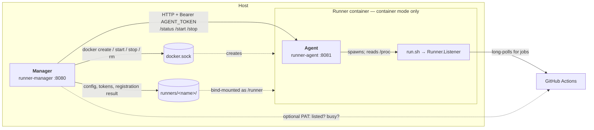

# 개발 및 빌드

**文档 / Docs:** [EN](../development.md) · [中文](../zh/development.md) · [Français](../fr/development.md) · [Deutsch](../de/development.md) · 한국어 · [日本語](../ja/development.md)


프로덕션은 컨테이너 배포를 사용하세요. [사용 가이드](guide.md) 참조. 이 문서는 기여자용: 로컬 빌드 및 디버그입니다.

## 요구 사항

- Go 1.27 ([go.mod](../../go.mod)과 일치).

## 아키텍처

프로세스는 셋. 알아둘 가치가 있는 것은 각자가 무엇을 맡는가입니다.



다이어그램의 라벨은 모든 번역본에서 영어로 둡니다. 프로세스 이름, 경로, 엔드포인트이며
식별자를 번역하면 읽기 쉬워지기는커녕 grep만 어려워집니다.

**Manager는 오케스트레이션만 하고 Runner를 품지 않습니다.** 컨테이너 모드에서는 각 Runner가 자신의
컨테이너가 되며, Manager가 호스트의 Docker socket을 통해 만듭니다 — Manager에게 그 socket이 필요하고
DinD를 가리켜서는 안 되는 이유가 이것입니다. 기본 모드에서는 Agent도 Runner 컨테이너도 없습니다.
Runner 프로세스는 Manager 자신의 컨테이너 안에서 돌고, Manager가 `/proc`을 직접 읽습니다.

**상태는 프로세스 경계를 넘으므로 HTTP를 탑니다.** Manager와 Runner 컨테이너는 PID namespace가 달라
Manager가 Runner의 프로세스를 볼 수 없습니다. 그래서 Agent에게 묻고, Agent가 자기 `/proc`을 읽습니다.
이 호출에는 Runner별 bearer 토큰이 실립니다 — 같은 Docker 네트워크의 어떤 컨테이너든 Agent의
`/start`와 `/stop`에 닿을 수 있기 때문입니다. 호출이 실패하면 답은 `installed`가 아니라 `unknown`입니다.
"등록되었지만 실행 중이 아니니 시작하자"가 애초에 닿지도 못한 Runner에 대해 발동해서는 안 됩니다.
[실행 상태를 판정하는 방법](#실행-상태를-판정하는-방법)을 참조하세요.

**아홉 가지가 `docker create` 시점에 고정**되고 그 뒤로는 바뀌지 않습니다: 컨테이너 이름, 이미지,
네트워크, 마운트 디렉터리, Job 내 Docker 백엔드, DinD 호스트, docker GID, Agent 토큰, 그리고 리소스
상한. `docker start`는 이미 만들어진 것을 그대로 다시 띄울 뿐이므로, 설정만 바꿔서는 기존 컨테이너에
결코 닿지 않습니다. 드리프트 감지가 존재하는 이유가 전부 이것입니다 — Manager는 각 컨테이너의 실제
생성 파라미터를 현재 설정과 대조해, **중지된** 것은 다음 시작 때 다시 만들고 **실행 중인** 것은 Job을
끊는 대신 표시만 합니다. 이미지는 참조뿐 아니라 ID로도 비교하므로 같은 tag를 다시 빌드한 경우도
포함됩니다.

## 빌드

```bash
# runner-manager 바이너리 빌드
go build -o runner-manager ./cmd/runner-manager

# 버전 포함 (/version 및 디버깅용)
go build -ldflags "-X main.Version=1.7.1" -o runner-manager ./cmd/runner-manager

# Runner Agent만 빌드 (컨테이너 모드)
go build -o runner-agent ./cmd/runner-agent

# 또는 Make: make build / make build-agent / make build-all
```

템플릿은 Manager 바이너리에 임베드됩니다(`cmd/runner-manager/templates/`). 단일 바이너리로 `templates/` 디렉터리 없이 배포 가능합니다.

## 로컬 실행 및 디버그

```bash
mkdir -p config && cp config.yaml.example config/config.yaml
go run ./cmd/runner-manager
# 또는 make run (빌드 후 실행); 사용자 설정: ./runner-manager -config /path/to/config.yaml
```

`:8080`에서 수신, http://localhost:8080. 디버그용 Basic Auth: `BASIC_AUTH_PASSWORD=secret go run ./cmd/runner-manager`. [사용 가이드 – 보안](guide.md#4-보안-및-검증) 참조.

## CLI 플래그

- `-config <path>`: 설정 파일 경로.
- `-version`: 버전 출력 후 종료(빌드 시 `-ldflags "-X main.Version=..."`로 주입).

## HTTP API

Basic Auth 사용 시 `/health`와 `/ready`를 제외한 모든 요청에 Header `Authorization: Basic <base64(user:password)>`가 필요합니다.

| 경로 | 메서드 | 설명 |
|------|--------|------|
| `/health` | GET | 라이브니스. `{"status":"ok","service":"runner-fleet"}` 반환. 의존성 검사 없이 프로세스가 살아 있으면 항상 200. 항상 인증 없음. |
| `/ready` | GET | 레디니스. 본문 형태는 동일. 설정을 읽을 수 없거나 runner 기본 디렉터리가 없거나 쓸 수 없으면 503. K8s `readinessProbe`용. 마찬가지로 인증 없음이며 어떤 검사가 실패했는지는 알리지 않음. |
| `/version` | GET | `{"version":"..."}` 반환. |
| `/metrics` | GET | Prometheus 메트릭(요청 수와 지연). `path` 라벨은 요청 URL이 아니라 Echo 라우트 템플릿(`/api/runners/:name`). Basic Auth 사용 시 **인증 필요** — 스크레이프 작업에 `basic_auth` 설정. |
| `/api/runners` | GET | Runner 목록. 컨테이너 모드에서 probe 실패 시 `status=unknown`과 구조화된 `probe`(`error/type/suggestion/check_command/fix_command`) 반환. |
| `/api/runners/:name` | GET | 단일 Runner 상세. 컨테이너 모드에서 probe 실패 시 동일한 `probe`. |
| `/api/runners/:name/start` | POST | Runner 시작. probe 실패 시에도 시작 시도, 응답에 구조화된 `probe` 반환. |
| `/api/runners/:name/stop` | POST | Runner 중지. probe 실패 시에도 중지 시도, 응답에 구조화된 `probe` 반환. |
| `/api/runners` | POST | Runner 추가(선택적으로 설치 및 등록). 이름이 충돌하면 조용히 이름을 바꾸지 않고 **409**와 함께 `conflicts`, `suggested_name`을 반환합니다. 예전의 자동 개명 동작이 필요하면 `auto_rename: true`를 보내세요. |
| `/api/runners/:name` | DELETE | Runner 삭제: 중지하고, PAT가 있으면 GitHub에서 등록 해제하고, 설치 디렉터리를 지우고, 설정에서 제거합니다. 응답에는 `github_deregistered`와 GitHub 쪽에서 무슨 일이 있었는지 알려주는 `message`가 담깁니다. |
| `/api/runners/:name/recreate` | POST | 현재 설정으로 Runner 컨테이너를 삭제 후 다시 만듭니다(컨테이너 모드 전용). 실행 중인 Job은 중단됩니다. 정지된 컨테이너는 "시작"할 때 생성 파라미터 불일치를 감지해 자동으로 재생성됩니다. |
| `/api/runner-precheck` | GET | 추가 전 이름 사전 점검: `?name=&path=`. `available`, `suggested_name`과 발견된 `conflicts`(`name_taken`, `container_name`, `install_dir`, `dir_registered`, `dir_adopt`, `dir_exists`, `container_exists`)를 반환하며, 각 항목에는 `level`(`error`/`warn`), `message`, `detail`과 선택적 `fix_command`가 있습니다. 읽기 전용이며 웹 UI가 입력 중에 호출합니다. |
| `/api/runner-rows` | GET | 목록의 `<tbody>`만 렌더링하며, 첫 화면과 같은 템플릿 조각을 사용합니다. 웹 UI가 이를 폴링해 목록을 제자리에서 갱신합니다. |
| `/static/*` | GET, HEAD | 내장된 스타일시트와 스크립트(`//go:embed`). 주소에 콘텐츠 지문(`?v=<hash>`)이 붙으며, 지문이 있는 요청은 오래 캐시되고 없는 요청은 재검증합니다. 탐사 스크립트나 프록시가 405를 받지 않도록 `HEAD`도 `GET`과 함께 등록합니다. |

### 교차 사이트 요청(CSRF)

쓰기 엔드포인트(`POST`, `PUT`, `DELETE`)는 브라우저가 교차 사이트라고 보고한 요청을 거부합니다.
이 방어가 없으면 다른 오리진의 페이지가 `POST /api/runners`로 폼을 제출할 수 있습니다. 이는 CORS에서 말하는
"단순 요청"이라 프리플라이트 없이 전송되며, 브라우저는 이 오리진에 대해 캐시해 둔 Basic 인증 정보를
자동으로 덧붙입니다. 즉 관리자가 악성 페이지를 열기만 해도 Runner를 추가하거나 중지시킬 수 있었습니다.
`PUT`과 `DELETE`는 항상 프리플라이트되므로 애초에 노출된 적이 없습니다. 노출되어 있던 쪽은 `POST`이고,
`/api/runners/:name/{start,stop,recreate}`는 모두 POST입니다.

판정은 `Sec-Fetch-Site`를 먼저 봅니다. 브라우저가 로컬에서 계산하므로 리버스 프록시가 `Host`를 바꿔 써도
깨지지 않습니다(Chrome 76+, Firefox 90+, Safari 16.4+). 통과하는 값은 `same-origin` 뿐이며
`same-site`는 통과시키지 않습니다 — 서브도메인이나 다른 포트는 다른 오리진이고, 여기는 관리 화면이기 때문입니다.
이 헤더를 보내지 않는 구형 브라우저는 `Origin`과 요청의 `Host`를 비교하는 방식으로 내려갑니다.
현재 브라우저는 교차 사이트 POST에서 반드시 `Origin`을 보냅니다.

두 헤더가 **모두** 없는 요청은 브라우저에서 온 것이 아닙니다(curl, CI 스크립트). 쿠키도, 캐시된 Basic 인증 정보도
가지고 있지 않으므로 CSRF가 될 수 없어 그대로 통과시킵니다 — API는 계속 스크립트로 호출할 수 있고,
어디에도 토큰이나 추가 헤더가 필요하지 않습니다.

그 결과 두 가지:

- **요청 본문은 JSON만 받습니다.** `AddRunnerRequest`와 `UpdateRunnerRequest`에는 `form` 태그가 없으므로,
  설령 미들웨어를 지나쳤더라도 폼 인코딩 요청은 빈 구조체에만 바인딩되어 필수 검증에서 걸립니다.
  웹 UI는 원래 JSON으로 전송합니다 — `FormData`는 폼 요소에서 값을 읽어오는 용도로만 씁니다.
- **`TRUSTED_ORIGINS`가 탈출구입니다.** 리버스 프록시가 `Host`를 바꿔 써서 본인의 요청까지 거부된다면,
  브라우저 주소창에 보이는 오리진을 쉼표로 구분해 지정하세요(`https://ci.example.com`).
  여기에 적은 오리진은 `Sec-Fetch-Site` 값과 무관하게 허용되므로, 직접 관리하는 오리진만 넣으세요.

### 호환성 변경 (업그레이드 참고)

이전 평면 필드 `probe_*`는 제거되었습니다. `probe` 객체 사용: `probe.error`, `probe.type`, `probe.suggestion`, `probe.check_command`, `probe.fix_command`. `probe.type` 값: `docker-access`, `agent-http`, `agent-connect`, `unknown`. Web UI는 `status=unknown`일 때 "Start/Stop"으로 자가 복구 가능.

예시 (probe 실패):

```json
{
  "name": "runner-a",
  "status": "unknown",
  "probe": {
    "error": "agent returned 502: bad gateway",
    "type": "agent-http",
    "suggestion": "Check runner container logs and Agent + /runner process state",
    "check_command": "docker ps -a | rg \"github-runner-\" && docker logs --tail=200 <runner_container_name>",
    "fix_command": "docker restart <runner_container_name>"
  }
}
```

### 실행 상태를 판정하는 방법

`internal/runnerproc`는 "이 Runner의 프로세스가 살아 있는가"라는 질문에, `/proc`을 훑어 argv가 해당
설치 디렉터리를 가리키는 프로세스 — `<dir>/bin/Runner.Listener`, 또는 `<dir>/run.sh`나
`<dir>/run-helper.sh`를 실행 중인 셸 — 를 찾는 방식으로 답합니다.

pid 파일은 의도적으로 읽지 **않습니다**. actions/runner가 아예 쓰지 않기 때문입니다. `run.sh`,
`run-helper.sh.template`, `runsvc.sh` 어느 것도 pid를 어디에도 기록하지 않으며, pid는 셸 변수 안에만
존재합니다. 설치 디렉터리의 `.path`에 들어 있는 것은 pid가 아니라 PATH 문자열입니다
(`runsvc.sh` 자신이 `export PATH=$(cat .path)`로 씁니다). 둘 중 어느 이름을 읽어도 반드시 실패하므로,
모든 Runner가 영원히 "등록됨, 실행 중 아님"으로 보고되었습니다.

`Runner.Listener`가 잠시 사라져도 감독 셸은 실행 중으로 셉니다. `run-helper.sh`는 종료 코드 2에서 5초간
sleep하고 그 뒤 `run.sh`가 리스너를 다시 띄우므로, 리스너만 보는 판정은 재시작 때마다 Runner를
죽은 것으로 판단하게 됩니다.

호출자에게 주는 영향 두 가지:

- `runner.List`는 디스크 관점의 뷰입니다. 컨테이너 모드에서 그 `Running`은 항상 false입니다 — Manager와
  Runner는 서로 다른 PID 네임스페이스에 있습니다. 판정 결과가 동작을 유발하는 자리에서는 언제나
  `runner.ListWithLiveStatus`를 쓰세요. 각 컨테이너의 Agent에 물어보고, 탐지 실패를 `installed`가 아니라
  `status=unknown`으로 매핑하므로 "등록됐는데 실행 중이 아니니 띄운다"가 닿지 못한 Runner에 대해
  발동하지 않습니다.
- 탐지에는 `/proc`이 필요하므로 Linux 전용입니다. 그 밖에서는 "실행 중 아님"으로 보고합니다.

### Runner 디렉터리 권한

Runner의 설치 디렉터리는 0700으로 만들어집니다. `config.sh`가 그 안에 `.credentials_rsaparams` —
Runner가 GitHub에 인증할 때 쓰는 RSA 개인 키 — 를 쓰는데, actions/runner는 Unix 권한을 전혀 설정하지
않습니다(`ConfigurationStore`는 Windows의 Hidden 속성만 세우므로 파일은 umask를 따라 보통 0644가 됩니다).
따라서 디렉터리 모드가 그 키와 호스트의 다른 로컬 사용자 사이를 막는 유일한 벽입니다.

`MkdirAll`은 이미 있는 디렉터리의 모드를 바꾸지 않으므로, 예전 버전이 만든 디렉터리는 0755 그대로입니다.
`Preflight`는 그것들을 즉석에서 바꾸는 대신 바로 실행할 수 있는 `chmod 700`과 함께 보고합니다.
Manager와 컨테이너가 서로 다른 UID로 동작하는 상황에서 조이면 멀쩡히 돌던 배포가 깨질 수 있고,
그 판단은 사람이 해야 하기 때문입니다.

`base_path` 자체는 통과 가능한 상태로 둡니다 — 자격 증명을 두지 않는 곳이고, 컨테이너 모드에서는
호스트 쪽 마운트 지점이기 때문입니다.

이것이 Job이 닿을 수 있는 범위를 바꾸지는 않습니다. `job_docker_backend: host-socket`에서는 Job이 호스트의
임의 경로를 바인드 마운트할 수 있고, 그 점은 배포 문서가 이미 경고하고 있습니다. 여기의 모드가 막는 것은
같은 호스트의 다른 로컬 사용자이지 그쪽이 아닙니다.

### Runner 삭제와 GitHub

`DELETE /api/runners/:name`은 Runner를 이 도구에서 **그리고** GitHub에서도 삭제합니다. GitHub 쪽에는
자격 증명이 필요한데, 이 도구가 가질 수 있는 유일한 것은 Runner별 선택적 PAT —
`<runner 디렉터리>/.github_check_token`, 가시성 확인이 쓰는 것과 같은 파일 — 입니다. 그래서 등록 해제는
설치 디렉터리를 지우기 **전에** 수행됩니다. 토큰이 바로 거기에 있기 때문이며, 순서를 뒤집으면
등록 해제할 수단 자체를 조용히 잃게 됩니다.

PAT가 없으면 등록 해제를 할 수 없습니다. GitHub는 PAT 아니면 새로 발급한 removal token을 요구하고,
`config.sh remove`는 후자를 요구합니다. 그런 경우 응답이 그 사실을 밝히고 직접 지울 위치를 알려줍니다.
삼키지 않고 말해 줄 값어치가 있습니다 — 남겨진 Runner가 있으면 다음 번
`config.sh --name <같은 이름>`이 `A runner exists with the same name`으로 실패하기 때문입니다.

`registered_on_github`는 **nullable** bool입니다. `true` / `false`는 답이고, `null`은 답에 이르지 못했다는
뜻이며 이유는 `github_check_error`가 담습니다. 템플릿에서 `{{if .RegisteredOnGitHub}}`로 판정하면 안 됩니다 —
`html/template`은 포인터를 nil인지 아닌지로만 판단하므로 `false`를 가리키는 포인터도 참이 됩니다.
`RunnerInfo`의 `GitHubYes` / `GitHubNo` / `GitHubUnknown` 헬퍼를 쓰세요.

## Makefile 타깃

- `make help`: 모든 타깃 표시.
- `make build`: Manager 빌드(Version ldflags 포함).
- `make build-agent`: Runner Agent 빌드(컨테이너 모드).
- `make build-all`: Manager와 Agent 빌드.
- `make test`: 테스트 실행.
- `make test-race`: 레이스 검출기와 함께 테스트 실행(CI가 돌리는 것).
- `make lint`: `./...`에 golangci-lint 실행. CI Test job의 Lint 단계와 동일.
- `make check`: CI가 확인하는 것을 한 타깃에 모음 — gofmt, vet, lint, `-race` 테스트, 두 개의 일관성 검사. 푸시 전에 실행.
- `make run`: Manager 빌드 후 실행.
- `make docker-build` / `make docker-run` / `make docker-stop`: Manager 이미지 빌드 및 실행. [사용 가이드](guide.md) 참조.
- `make docker-build-runner`: 컨테이너 모드용 Runner 이미지 빌드(`Dockerfile.runner`, 기본 태그는 `RUNNER_IMAGE`).
- `make docker-build-runner-example`: 커스텀 Runner 이미지 예제 빌드(`EXAMPLE=android|node`, [`examples/runner-images/`](../../examples/runner-images/) 참조).
- `make clean`: 빌드된 바이너리 제거(runner-manager, runner-agent).

컨테이너 모드는 `cmd/runner-agent`의 Agent와 `Dockerfile.runner`의 Runner 이미지를 사용합니다.

## 테스트

`go test ./...`, 또는 CI가 실제로 돌리는 `make test-race`. 모든 CI와 릴리스 workflow가 `go test -race`를
실행하므로, 데이터 경합은 나중에 운영에서 "가끔 상태가 이상하다"로 드러나는 대신 그 자리에서 빌드를
실패시킵니다 — 이 프로젝트의 동시성(단일 워커 등록 큐, Runner별 `runnerOps` 락, `EnsureAgentToken`의
단일 승자 생성)은 타입 시스템이 강제하지 않는 관례 위에 서 있기 때문입니다. 저장소의 golangci-lint는
CI에서 돕니다. 로컬에서 돌릴 수 없다면 `go run`으로 부르는 `errcheck`와 `staticcheck`가 지적 사항의
대부분을 덮습니다.

테스트를 추가하기 전에 알아 두면 좋은 관례:

- **프로세스 탐지는 가짜 `/proc`이 아니라 실제 프로세스를 상대로 검증합니다**(`internal/runnerproc`,
  `internal/runner`, `cmd/runner-agent`). 블로킹하는 임시 `run.sh`로 Runner를 대신하되 `exec`하면
  안 됩니다 — exec하면 셸이 대체되어 argv가 `internal/runnerproc`이 찾는 형태와 달라집니다.
- **`cmd/runner-manager` 테스트는 `main()`이 호출하는 함수들을 통해 배선에 닿습니다**(`basicAuthMiddleware`,
  `httpErrorHandler`, `registerRoutes`, `listenAddr`, `loadI18n`). 라우트를 추가하면
  `TestRegisterRoutes_AllEndpointsPresent`도 함께 갱신하세요. 정확한 집합을 단언하므로,
  새 라우트에 인증이 필요한지 생각하게 만드는 장치이기도 합니다.
- **미들웨어는 단독으로만이 아니라 `newEchoServer()`를 통해 테스트합니다.** 제대로 작성했지만 장착되지
  않은 것이 이런 방어의 전형적인 실패 방식이라, `TestCSRFGuardIsMountedOnWriteRoutes`는 실제 라우트
  테이블을 두드립니다. 쓰기 라우트를 추가하면 거기 `writeRoutes`에도 추가하세요.
- **i18n 파일은 서로 교차 검증됩니다.** `en.json`에 있고 다른 곳에 없는 키는 조용히 빈칸으로 렌더링되므로,
  테스트가 6개 언어의 키 집합이 일치하는지, 빈 값이 없는지, 템플릿이 참조하는 키가 모두 존재하는지를
  단언합니다.
- **템플릿에서 난 결함에는 템플릿 수준 테스트를.** 과거 두 건의 버그는 Go가 아니라 `index.html`에
  있었습니다 — `*bool`에 `{{if}}`를 써서 `false`를 가리키는 포인터를 참으로 읽은 건과, `innerHTML`
  대입이 `escapeHtml`을 건너뛴 건. 둘 다 실제 템플릿을 렌더링하거나 훑는 방식으로 덮습니다.
  Go 헬퍼만 테스트해서는 어느 쪽도 알아채지 못했을 것이기 때문입니다.

- **문서도 코드처럼 검사된다.** `internal/docsconsistency`에는 테스트만 있고 런타임 코드는 없습니다.
  ci-recipes가 보는 제목 수준 **아래**——표의 행, 코드 블록, 목록 항목, 해석된 링크 대상——에서
  각 번역본을 영어 원문과 비교합니다. 실제로 일어난 드리프트가 제목이 아니라 표의 한 줄이었기
  때문입니다. 또한 Markdown이 아닌 파일에서 참조하는 경로가 실제로 존재하는지, 문제 해결 문서가
  `grep`하라고 알려주는 마커가 코드가 실제로 남기는 것인지, `examples/` 아래 모든 README에
  언어 정책이 등록되어 있는지도 확인합니다.

## 릴리스

문서와 예제의 버전 참조는 `internal/config/config.go`의 기본 이미지 태그와 일치해야 합니다. CI는 `ci-recipes runner-fleet check-version-consistency`로 검사합니다. 릴리스 PR을 열기 전에 로컬에서 실행하세요:

```bash
ci-recipes runner-fleet check-version-consistency
```

두 검사는 [soulteary/ci-recipes](https://github.com/soulteary/ci-recipes)가 제공합니다. 저장소별 CI 셸을
테스트된 하나의 Go 바이너리로 대체하며, 이 저장소는 `scripts/ci-recipes.conf`만 제공합니다.
CI가 고정한 버전을 설치하세요:

```bash
make install-ci-recipes
```

고정값은 `.github/workflows/ci-consistency.yml` 한 곳에만 있고, Makefile이 그곳에서 읽습니다.

이전 버전을 정당하게 인용하는 줄(릴리스 노트, 업그레이드 안내)에는 `version-check-ignore` 마커를 붙입니다.

번역본에도 같은 장치가 있습니다. `ci-recipes runner-fleet check-docs-structure`는 각 `docs/<lang>/*.md`의
제목 레벨 시퀀스를 영어 원본과 비교합니다 — 제목 문구는 달라야 하지만 구조는 달라서는 안 됩니다.
영어판에 절을 추가하고 5개 번역이 따라가지 않으면 조용히 묻히는 대신 그 자리에서 PR이 실패합니다:

```bash
ci-recipes runner-fleet check-docs-structure
```

두 가지 검사는 모든 PR이 아니라 릴리스 시점에 동작합니다. `.github/actions/check-release-version`은
`v*.*.*` 태그에서 실행되며, `internal/config/config.go`의 기준 버전이 그 태그와 같고
`CHANGELOG.md`에 대응하는 `## [X.Y.Z]` 절과 링크 정의가 있어야 통과시킵니다.
`check-version-consistency`는 이것을 볼 수 없습니다. 그 기준 자체를 사실로 삼기 때문에,
공개된 릴리스보다 한 패치 뒤처져 있어도 내부적으로 일관되면 그대로 통과합니다 —
어떤 릴리스가 나왔는데 트리 어디에서도 그것을 가리키지 않았던 이유가 바로 이것입니다.
`CI (Consistency)`의 `Quick start runs`는 로컬에서 빌드한 이미지를 상대로 가이드의 빠른 시작
명령 블록을 그대로 실행한 뒤 `GET /ready`를 요청합니다. 아무도 실행하지 않는 문서화된 절차는,
망가진 줄 아무도 모르는 절차이기 때문입니다.

이 파일 옆에는 메인테이너용 작업 기록이 두 개 있으며, 둘 다 제품 동작이 아니라 빌드에 대한
결정을 기록한 것이라 일부러 번역하지 않았습니다:
[CI 셸을 ci-recipes로 옮기기](../ci-recipes-migration.md)는 그 이동의 감사 기록이고(어떤 셸이
그쪽에 속했는지, 이식으로 고쳐진 네 가지 결함, 그 대가),
[문서 개선 계획](../docs-improvement-plan.md)은 여기 있는 검사들이 나온 출처로 무엇이 끝났고
무엇이 남았는지가 적혀 있습니다.

[← 문서로 돌아가기](README.md)
