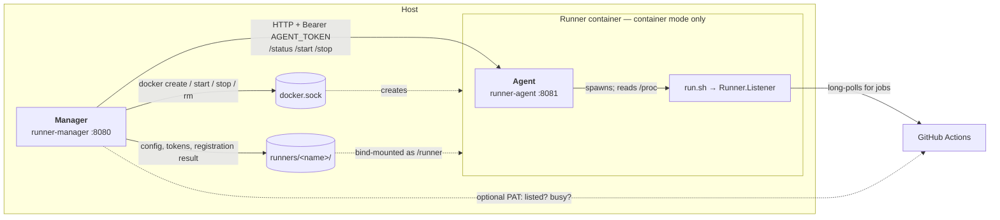

# 开发与构建

**文档 / Docs:** [EN](../development.md) · 中文 · [Français](../fr/development.md) · [Deutsch](../de/development.md) · [한국어](../ko/development.md) · [日本語](../ja/development.md)


生产环境请使用容器部署，见 [使用指南](guide.md)。本文档面向贡献者本地构建与调试。

## 环境要求

- Go 1.27（与 [go.mod](../../go.mod) 一致）。

## 架构

三个进程。值得知道的是它们各自管什么。



图里的标签在所有译文里都保持英文：那些是进程名、路径与端点，把标识符翻译掉只会更难 grep，
并不会更好读。

**Manager 只做编排，不承载 Runner。** 容器模式下每个 Runner 是一个独立容器，由 Manager 通过宿主机的
Docker socket 创建——这也是 Manager 必须拿到那个 socket、且不能把它指向 DinD 的原因。默认模式下
根本没有 Agent、也没有 Runner 容器：Runner 进程就跑在 Manager 自己的容器里，Manager 直接读 `/proc`。两种模式下，握着 PID 1 的那个进程都
负责在退出前把 Runner 停掉：Agent 收到 SIGTERM 会先停止 Runner 再退出，默认模式下 Manager 对自己容器里的
Runner 做同样的事。两者前面都站着 `tini`，负责回收 Job 留下的孤儿进程。

**状态要跨进程边界，所以走 HTTP。** Manager 与 Runner 容器不在同一个 PID namespace，看不见对方的进程，
于是它去问 Agent，由 Agent 读自己的 `/proc`。这次调用带一个按 Runner 生成的 bearer 令牌——同一个 Docker
网络里的任何容器都够得着 Agent 的 `/start` 与 `/stop`。调用失败时答案是 `unknown` 而不是 `installed`：
「已注册但没在跑，那就拉起来」这条逻辑，绝不能作用在一个根本没探到的 Runner 上。
见[运行状态是怎么判定的](#运行状态是怎么判定的)。

**有九样东西在 `docker create` 那一刻定死**，之后再不会变：容器名、镜像、网络、挂载目录、Job Docker
后端、DinD 主机、docker GID、Agent 令牌，以及资源上限。`docker start` 只是把已经建好的那个原样拉起来，
所以光改配置永远到不了已存在的容器。这就是漂移检测存在的全部理由——Manager 比对每个容器的实际创建参数
与当前配置，**已停止**的在下次启动时重建，**正在运行**的只打标记而不去打断 Job。镜像除了比引用还比
镜像 ID，所以重新 build 同名 tag 同样算数。

## 构建

```bash
# 生成可执行文件 runner-manager
go build -o runner-manager ./cmd/runner-manager

# 注入版本号（便于 /version 与排障）
go build -ldflags "-X main.Version=1.9.0" -o runner-manager ./cmd/runner-manager

# 仅构建 Runner Agent（容器模式用）
go build -o runner-agent ./cmd/runner-agent

# 或使用 Make：make build / make build-agent / make build-all
```

模板已通过 `embed` 内嵌于 Manager 二进制（`cmd/runner-manager/templates/`），可执行文件可单文件分发，无需附带 `templates/` 目录。

## 本地开发与调试

```bash
mkdir -p config && cp config.yaml.example config/config.yaml
go run ./cmd/runner-manager
# 或 make run（先 build 再运行）；指定配置：./runner-manager -config /path/to/config.yaml
```

默认监听 `:8080`，http://localhost:8080。Basic Auth 调试：`BASIC_AUTH_PASSWORD=密码 go run ./cmd/runner-manager`，见 [使用指南 - 安全与校验](guide.md#四安全与校验)。

## 命令行参数

- `-config <path>`：配置文件路径。
- `-version`：输出版本号后退出（构建时可通过 `-ldflags "-X main.Version=..."` 注入）。

## HTTP API

启用 Basic Auth 时，除 `/health`、`/ready` 外，请求需在 Header 中携带 `Authorization: Basic <base64(user:password)>`。

| 路径 | 方法 | 说明 |
|------|------|------|
| `/health` | GET | 存活探针。返回 `{"status":"ok","service":"runner-fleet"}`；不挂依赖检查，进程活着恒为 200；始终免鉴权。 |
| `/ready` | GET | 就绪探针。响应体同上；配置读不了、或 runner 根目录缺失/不可写时返回 503。供 K8s `readinessProbe` 使用；同样免鉴权，且不会说明是哪一项失败。 |
| `/version` | GET | 返回 `{"version":"..."}`。 |
| `/metrics` | GET | Prometheus 指标（调用量与延迟）。path 标签取 Echo 路由模板（`/api/runners/:name`），不是请求 URL。启用 Basic Auth 后**需要鉴权**，在抓取任务里配 `basic_auth`。 |
| `/api/runners` | GET | 返回 Runner 列表。容器模式下若状态探测失败，会返回 `status=unknown` 且带结构化 `probe`（含 `error/type/suggestion/check_command/fix_command`）。 |
| `/api/runners/:name` | GET | 返回单个 Runner 详情。容器模式下若状态探测失败，同样返回结构化 `probe`。 容器模式下若容器的创建参数与配置不一致，响应会额外带 `container_drift`。 |
| `/api/runners/:name/start` | POST | 启动指定 Runner。容器模式下若状态探测失败，仍会尝试启动，并在响应中返回结构化 `probe`。 |
| `/api/runners/:name/stop` | POST | 停止指定 Runner。容器模式下若状态探测失败，仍会尝试停止，并在响应中返回结构化 `probe`。 |
| `/api/runners` | POST | 添加 Runner（可选安装并注册）。名称冲突时返回 **409**，带 `conflicts` 与 `suggested_name`，不再静默改名；需要旧的自动加后缀行为可传 `auto_rename: true`。 |
| `/api/runners/:name` | DELETE | 删除 Runner：停止它、在有 PAT 时从 GitHub 注销、删除安装目录、从配置里移除。响应带 `github_deregistered`，以及一条说明 GitHub 那一侧实际发生了什么的 `message`。 |
| `/api/runners/:name/recreate` | POST | 按当前配置删除并重建 Runner 容器（仅容器模式）。会中断正在跑的 Job——已停止的容器在「启动」时若发现创建参数不一致，本就会自动重建。 |
| `/api/runner-precheck` | GET | 添加前的名称预检：`?name=&path=`。返回 `available`、`suggested_name` 与冲突列表 `conflicts`（`name_taken`、`container_name`、`install_dir`、`dir_registered`、`dir_adopt`、`dir_exists`、`container_exists`），每条含 `level`（`error`/`warn`）、`message`、`detail` 与可选的 `fix_command`。只读，界面在输入时会实时调用。 |
| `/api/runner-rows` | GET | 只渲染列表的 `<tbody>`，用的是首屏那份模板片段。界面轮询它来原地刷新列表。 |
| `/static/*` | GET、HEAD | 内嵌的样式表与脚本（`//go:embed`）。地址带内容指纹（`?v=<hash>`）：带指纹的长缓存，不带的只许协商缓存。`HEAD` 与 `GET` 一并注册，免得探活脚本或代理吃到 405。 |

### 跨站请求（CSRF）

写接口（`POST`、`PUT`、`DELETE`）会拒绝浏览器判定为跨站的请求。没有这一层时，任何其它来源的页面都能向
`POST /api/runners` 提交一个表单——那是 CORS 意义上的「简单请求」，不触发预检就会发出去，而浏览器会自动带上
它为本站缓存的 Basic Auth 凭据。也就是说，诱导管理员打开一个恶意页面，就足以添加或停掉一个 Runner。
`PUT` 与 `DELETE` 必定触发预检，本来就不是敞着的那部分；敞着的是 `POST`，而
`/api/runners/:name/{start,stop,recreate}` 全是 POST。

判据优先读 `Sec-Fetch-Site`：它由浏览器本地计算，反向代理改写 `Host` 也影响不到
（Chrome 76+、Firefox 90+、Safari 16.4+）。只有 `same-origin` 放行；`same-site` 不放行——
子域或另一个端口就是另一个源，而这是一个管理界面。老到不发这个头的浏览器回落到比较 `Origin` 与请求的
`Host`，跨站 POST 时当前所有浏览器都会带 `Origin`。

两个头都没有的请求不是浏览器发的（curl、CI 脚本）：它既没有 cookie 也没有缓存的 Basic Auth，
构不成 CSRF，因此放行——API 照样可脚本化，任何地方都不需要额外的令牌或请求头。

两点后果：

- **请求体只接受 JSON。** `AddRunnerRequest` 与 `UpdateRunnerRequest` 上没有 `form` tag，
  所以 form 编码的请求即便绕过了中间件，也只能绑出一个空结构体，随即被必填校验挡掉。
  界面本来就用 JSON 提交——它那处 `FormData` 只是用来就地读取表单元素里的字段值。
- **`TRUSTED_ORIGINS` 是逃生舱。** 如果反向代理改写了 `Host`，以致你自己的请求也被拒，
  就把浏览器地址栏里看到的来源填进去，逗号分隔（`https://ci.example.com`）。
  名单内的来源无论 `Sec-Fetch-Site` 说什么都会放行，所以只填你自己控制的域名。

### 升级注意（破坏性变更）

历史扁平字段 `probe_*` 已移除，请统一使用 `probe` 对象：`probe.error`、`probe.type`、`probe.suggestion`、`probe.check_command`、`probe.fix_command`。`probe.type` 可能值：`docker-access`、`agent-http`、`agent-connect`、`unknown`。WebUI 在 `status=unknown` 时仍可「启动/停止」自愈。

示例（探测失败）：

```json
{
  "name": "runner-a",
  "status": "unknown",
  "probe": {
    "error": "agent 返回 502: bad gateway",
    "type": "agent-http",
    "suggestion": "查看 runner 容器日志，确认 Agent 与 /runner 下脚本进程状态",
    "check_command": "docker ps -a | rg \"github-runner-\" && docker logs --tail=200 <runner_container_name>",
    "fix_command": "docker restart <runner_container_name>"
  }
}
```

### 运行状态是怎么判定的

`internal/runnerproc` 回答「这个 Runner 的进程还活着吗」的办法是扫 `/proc`，找 argv 里声称属于该安装目录的进程——
`<dir>/bin/Runner.Listener`，或是正在跑 `<dir>/run.sh`、`<dir>/run-helper.sh` 的 shell。

它刻意**不**读 pid 文件，因为 actions/runner 根本不写。`run.sh`、`run-helper.sh.template`、`runsvc.sh`
都没有把 pid 写到任何地方，pid 只存在于一个 shell 变量里。安装目录下的 `.path` 装的是一串 PATH，不是 pid
（`runsvc.sh` 自己就是 `export PATH=$(cat .path)` 这么用的）。照这两个名字去读必然失败，
于是每个 Runner 永远报「已注册但未运行」。

监护脚本也算在运行中，哪怕 `Runner.Listener` 这一刻不在：`run-helper.sh` 在退出码为 2 时会 sleep 5 秒，
随后 `run.sh` 再把监听器拉起来——只认监听器的判据会在每次重启的间隙把 Runner 判成死的。

对调用方有两个后果：

- `runner.List` 是磁盘视角的。容器模式下它的 `Running` 恒为 false——Manager 与 Runner 不在同一个 PID
  namespace。只要判定结果会触发动作，就该用 `runner.ListWithLiveStatus`，它去问每个容器里的 Agent，
  并把探测失败映射成 `status=unknown` 而不是 `installed`，这样「已注册未运行就拉起」不会落到一个
  根本够不着的 Runner 身上。
- 探测依赖 `/proc`，因此仅限 Linux；其它平台一律报「未运行」。

### Runner 目录权限

Runner 的安装目录按 0700 创建。`config.sh` 会把 `.credentials_rsaparams` 写进去——那是 Runner
用来向 GitHub 认证的 RSA 私钥，而 actions/runner 不给它设任何 Unix 权限（`ConfigurationStore`
只设了 Windows 的 Hidden 属性，于是文件跟随 umask，通常是 0644）。也就是说，目录权限是这把私钥
与宿主机上其他本地用户之间唯一的一道墙。

`MkdirAll` 不会改动已存在的目录，所以旧版本建出来的目录仍是 0755。`Preflight` 选择把它们报出来，
并附上一条可以直接执行的 `chmod 700`，而不是就地改掉：Manager 与容器以不同 UID 运行时，
贸然收紧会把一套本来正常的部署弄坏，这个决定该由人来做。

`base_path` 本身保持可穿越——它不存放任何凭据，而且在容器模式下它是宿主机的挂载点。

这不改变 Job 能够到什么。`job_docker_backend: host-socket` 下 Job 可以挂载宿主机的任意路径，
部署文档已经就此给过警告；这里的权限位防的是同机的其他本地用户，不是那个。

### 删除 Runner 与 GitHub

`DELETE /api/runners/:name` 会把 Runner 从本工具**以及** GitHub 上都删掉。GitHub 那一侧需要凭据，
而本工具手上唯一可能有的，就是可选的、每个 Runner 各自的 PAT——`config/tokens/<Runner 名称>`，
与可见性检查用的是同一个文件。所以注销仍然必须发生在删除安装目录**之前**：旧版本留在那个目录里的
PAT 会在这一步被顺手搬出来，顺序错了就等于悄悄失去了注销的能力。

没有 PAT 就注销不了：GitHub 要么要 PAT，要么要一个新鲜的 removal token，而 `config.sh remove`
要的正是后者。此时响应会如实说明，并指出去哪里手动删除。这件事值得说出来而不是咽下去——
残留的 Runner 会让下一次 `config.sh --name <同名>` 直接失败在 `A runner exists with the same name`。

`registered_on_github` 是**可空**布尔：`true` / `false` 是答案，`null` 表示没能得到答案，
原因放在 `github_check_error` 里。模板里不能用 `{{if .RegisteredOnGitHub}}` 去判断它——
`html/template` 只看指针是否为 nil，于是一个指向 `false` 的指针也是真。请用 `RunnerInfo` 上的
`GitHubYes` / `GitHubNo` / `GitHubUnknown` 三个辅助方法。

## Makefile 目标

- `make help`：查看全部目标。
- `make build`：构建 Manager（带 Version ldflags）。
- `make build-agent`：构建 Runner Agent（容器模式用）。
- `make build-all`：同时构建 Manager 与 Agent。
- `make test`：运行测试。
- `make test-race`：带竞态检测跑测试（CI 跑的就是这个）。
- `make lint`：对 `./...` 跑 golangci-lint，与 CI 里 Test job 的 Lint 那一步对应。
- `make check`：把 CI 会跑的检查收在一个目标里——gofmt、vet、lint、`-race` 测试与两个一致性检查。推之前跑它。
- `make run`：先 build 再运行 Manager。
- `make docker-build` / `make docker-run` / `make docker-stop`：Manager 镜像构建与运行，见 [使用指南](guide.md)。
- `make docker-build-runner`：构建容器模式用的 Runner 镜像（`Dockerfile.runner`，默认 tag 见 `RUNNER_IMAGE`）。
- `make docker-build-runner-example`：构建自定义 Runner 镜像示例（`EXAMPLE=android|node`，见 [`examples/runner-images/`](../../examples/runner-images/)）。
- `make clean`：删除生成的二进制（runner-manager、runner-agent）。

容器模式用的 Agent 为 `cmd/runner-agent`，Runner 镜像用 `Dockerfile.runner` 单独构建。


## 测试

`go test ./...`，或者直接 `make test-race`——那才是 CI 真正跑的。所有 CI 与发布 workflow 都跑
`go test -race`，这样数据竞态会当场让构建失败，而不是日后表现为线上偶尔出现的错误状态：
这个项目的并发面（单 worker 的注册队列、按 Runner 的 `runnerOps` 锁、`EnsureAgentToken`
的「单一胜者」创建）都是靠约定维持的，类型系统管不到。仓库的 golangci-lint 在 CI 里跑；
本地跑不了的话，用 `go run` 调 `errcheck` 与 `staticcheck` 能覆盖它标出的大部分问题。

往测试里加东西之前，有几条约定值得先知道：

- **进程探测是对着真进程测的**，不是造一个假的 `/proc`（`internal/runnerproc`、`internal/runner`、
  `cmd/runner-agent`）。用一个会阻塞的临时 `run.sh` 冒充 Runner 即可，但它**不能** `exec`——
  一 exec，shell 就被替换掉，argv 也就不再是 `internal/runnerproc` 要找的形态。
- **`cmd/runner-manager` 的测试通过 `main()` 所调用的那些函数够到接线**（`basicAuthMiddleware`、
  `httpErrorHandler`、`registerRoutes`、`listenAddr`、`loadI18n`）。加一条路由就要同步更新
  `TestRegisterRoutes_AllEndpointsPresent`，它断言的是完整集合——这正好逼你想一想新路由要不要鉴权。
- **中间件要通过 `newEchoServer()` 测，而不只是单独测它自己。** 写对了却没挂上，是这类防护
  最典型的失效方式，所以 `TestCSRFGuardIsMountedOnWriteRoutes` 走的是真实路由表。
  新增写接口时，记得把它加进那里的 `writeRoutes`。
- **i18n 文件之间互相校验。** `en.json` 里有、别处没有的键会静默渲染成空白，所以测试断言六种语言的键集相同、
  没有空值，并且模板引用到的每个键都存在。
- **模板层面的缺陷配模板层面的测试。** 过去有两个 bug 出在 `index.html` 而不是 Go 里——一个是对 `*bool`
  用 `{{if}}`，把指向 `false` 的指针读成了真；另一个是 `innerHTML` 赋值时漏了 `escapeHtml`。
  两者都由「渲染真实模板」或「扫描模板」来覆盖，因为只测 Go 辅助函数的话，哪个都发现不了。

- **文档和代码一样被测试。** `internal/docsconsistency` 里只有测试，没有运行时代码。
  它比对译文与英文原文在**标题之下**的内容——表格行、代码块、列表项、解析后的链接目标，
  因为真正发生过的漂移是一行表格而不是一个标题。它还校验非 Markdown 文件里引用的路径确实存在、
  排障文档让人 `grep` 的标记就是代码真正打出来的那个、以及 `examples/` 下每份 README
  都登记过语言策略。

## 发布

文档与示例中的版本号必须与 `internal/config/config.go` 里的默认镜像 tag 一致，CI 会通过 `ci-recipes runner-fleet check-version-consistency` 强制校验。提发布 PR 前可本地先跑：

```bash
ci-recipes runner-fleet check-version-consistency
```

两个检查来自 [soulteary/ci-recipes](https://github.com/soulteary/ci-recipes)——它用一个带测试的 Go
二进制替换各仓库自己的 CI shell，本仓库只出 `scripts/ci-recipes.conf`。装 CI 钉的那个版本即可：

```bash
make install-ci-recipes
```

版本只写在 `.github/workflows/ci-consistency.yml` 一处，Makefile 从那里读。

某一行确需引用历史版本号（变更说明、升级指引等）时，在该行加上 `version-check-ignore` 标记即可跳过。

译文同样有机制盯着。`ci-recipes runner-fleet check-docs-structure` 会把每个 `docs/<lang>/*.md` 的标题层级序列
与英文原版比对——标题文字本来就该不同，结构不该——于是「英文加了一节、五种译文没跟上」会当场让 PR 失败，
而不是一直没人发现：

```bash
ci-recipes runner-fleet check-docs-structure
```

有两项检查不在每个 PR 上跑，而是在发布时跑。`.github/actions/check-release-version` 由
`v*.*.*` 的 tag 触发：`internal/config/config.go` 里的基准版本必须等于该 tag，且 `CHANGELOG.md`
必须已有对应的 `## [X.Y.Z]` 小节与底部链接定义，否则发布当场失败。`check-version-consistency`
看不见这件事——它把那个基准当作事实，所以一个「整体落后已发布版本一个补丁号但内部完全自洽」
的仓库在它眼里是绿的，而那正是某次发布之后仓库里没有一处指向它的由来。`CI (Consistency)` 里的
`Quick start runs` 则拿就地构建的镜像整段执行使用指南里的快速开始命令块，再去请求
`GET /ready`——一段没人跑过的文档步骤，就是一段没人知道它坏了的步骤。

与本文同目录还有两份维护者的工作记录，刻意不做译文——它们记的是构建决策，不是产品行为：
[CI shell 迁移到 ci-recipes](../ci-recipes-migration.md) 是那次搬迁的审计（哪些 shell 该搬、
迁移修掉的四个缺陷、代价是什么），[文档改进计划](../docs-improvement-plan.md) 则是上面这些
检查的出处，里面写着哪些已做、哪些还开着。

[← 返回文档](README.md)
